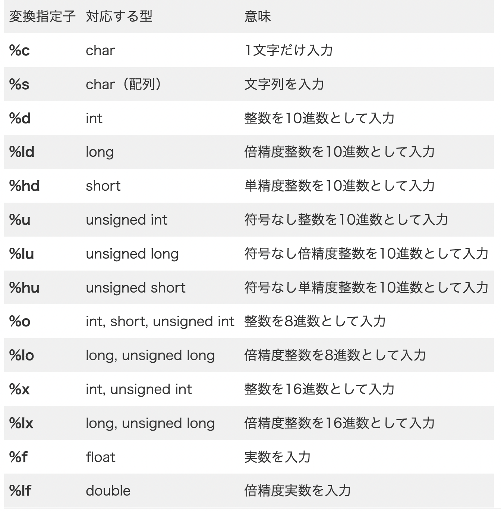

# C言語のあれこれ
- 各アルゴリズムの解説を行う前に最低限必要なC言語の知識を記載した。
- 各アルゴリズムの解説は各ディレクトリのmdに記載した
# 目次
1. [始めるにあたって](#anchor1)
2. [入出力のルール](#anchor2)
3. [分岐処理](#anchor3)
4. [繰り返し処理](#anchor4)
5. [関数](#anchor5)
6. [変数](#anchor6)
7. [配列](#anchor7)
8. [文字列](#anchor8)
9. [ポインタ](#anchor9)
10. [構造体](#anchor10)


# 始めるにあたって<a id="anchor1"></a>

## #include <stdio.h>
- 元々ある多くの関数をインポートしている
    - この一行で10000行もの処理が短縮されている
    - standardIOとheaderファイルの省略
    - 基本的な入出力を実行できるようにする(printf関数など)
    - #は最初に実行してくれる
## int main(void){}
- 関数の中の処理は上から下に実行されるが、関数同士の順番は決めれられていない
    - つまり関数に順番をつけないと、どの関数から実行すればいいかわからなくなる
    - そこでC言語ではmainの関数を最初に実行するルールがある
    ## int
    - どれくらいのメモリを使うのかを指定する。
    - intは4バイト(4バイトのメモリを使う)
        - intは整数を返す指定がある
    ## main
    - 関数の名前
        - 最初に処理を開始するときはmain関数
        - それ以外の関数は名前を自由につけていい
    ## void
    - 引数(ここら辺はpyhtonと一緒)
    - 引数がないときvoidとなる
    ## return 0
    - 関数の処理が終わったことを表している
    - return 1というのもある
## gcc
- GNU社が作っているコンパイラのソフト    
- コンパイラとは人間が描いたプログラミング言語をPCがわかるようにバイナリ化すること
- バイナリデータとは01で作られたもの

# 入出力のルール<a id="anchor2"></a>
## 改行
```
printf("Hello\n")
```
- ""の中に\nを入れる
- ポイントは最後につけるということ
## 数値の出力
- 文字列と数値の出力は少し違う
    - 文字列: printf("")
    - 数値: printf("")と出力変換指定子を使う
    ```
    printf("%d",100)
    ```
    - こうすることで100という整数を出力することができる。
    - %dの中に数値が代入され、それを出力している形になる。
        - つまり100円と出力したかったら
        ```
        printf("%d円",100)
        ```
        とすればいい
    - また複数の整数を扱いたかったら
    ```
    printf("%d円のりんごが%d個",100,2)
    ```
    とすれば、「100円のりんごが2個」となる
## 整数の計算
- 足し算
    ```
    printf("%d",10+3);
    ```
- 引き算は-,掛け算は*,割り算は/
    - 割り算は割った商を示す
## 小数
- ％dではなく%fを用いる
## 変数
- C言語はメモリという概念があり、メモリにスペースを確保し、そこに値を格納することで変数と指定することができる。
    - メモリを保持した後は値を自由に変更できるので変数と言われる
    - イメージは一度契約した土地は私物になるため、家を建てても店を建てても何をしても良いという感じ
1. まずは宣言を行う
    - データ型、変数名で行う。
    ```
    int value
    ```
    - これはvalueという名前の変数を用いて、int(4バイト)分のスペースをメモリに対して契約するという意味である。
    - メモリはマンションのような構造をしており、無限の階数があるところから4階分の大きさのフロアを借りているイメージ
2. 宣言した変数名に値を代入する
    ```
    value = 100;
    ```
## メモリとデータ型の関係
- valueは4バイトを使う
    - つまり0000,0001,0010,0011の4つを使うイメージである
    - shortは2バイト使う
    - doubleは8バイト
    - charは1バイト
- しかし、メモリの保存場所が分かりにくい！！
    - メモリに入っている値をもう少し、簡単に扱う方法があるはず！
    - そこで変数を宣言することで分かりやすくなる！
        - 店に客が訪れるというシチュエーションを想定しよう、階数を伝えるのではなく店名を伝えた方がわかりやすいよね！
        - そういうことで契約したマンションの階数に名前をつけることで分かりやすくしているのである！！
## 変数の初期化
- int main = 10
- 上記では
    1. まずは容量を確保して名前をつける
    2. そこに変数を代入<br>といったような処理を行なっていたが、これを同時にできるということである。
## 小数の扱い
- intは整数だったが小数を扱うデータ型はdoubleとfloatである
- 基本はdoubleでいい
- 変換指定子は％dではなく%fを用いる
## 変換指定子と型変換の関係性
- 変数を用いるためにはまず型を指定、その型にあった変換指定子を用いて出力する
 
- また出力する時に、変換指定子と型があっていないとエラーになってしまうので型と一致する変換指定子を返す必要がある
```
printf("%d",3.14);
```
- では小数を整数で表して出力するにはどうすれば良いのか(次に説明)
## キャスト変換
    printf("%d",(int) 3.14);
- このように小数を整数で出力する手法をキャスト変換という
## キーボードからの文字入力 scanf関数
1. 型を指定
2. scanf("変換指定子",&変数名);で入力した値を変数に代入
- 例
    ```
    int suuti;
    scanf("%d",&suuti);
    ```
## なぜscanf関数に&がいるのか
- ＆は変数の中身ではなくどのメモリに保存されているのかを表す
- scanf関数において&suutiは引数の役割をしている。
- この時引数にはsuutiの中の中身自体がほしいわけではなく、どこのメモリをsuutiという変数が格納されているかである
    - つまり中身ではなく住所がほしいのである(マンションで例えると、何を売ってる店なのかではなく、その店が何階にあるかが重要と言うことである)
- そのため&をつけることでsuutiの中身ではなく、住所を受け取っている。
# 分岐処理<a id="anchor3"></a>
## if文による条件分岐
- if(条件式)　処理;という書き方
- 条件式の中にはTrue,Falseかを判断する文章を入れる
    - 数値のみを代入した場合は0ならFalse,それ以外ならTrueの処理を行う
    - Trueの場合のみ処理が走るという感じである
- Falseの処理を実行したかったらelse文を記載する。
- 例
    ```
    int apple = 10;
    if (apple == 0){
        printf("りんごは0個です");
    }
    else{
        printf("りんごが0個です");
    }
    ```
## 論理演算子
- ベン図でおける「かつ」と「または」を実装する方法は
    - &&でかつ
    - ||でまた
        を表す
## swich文による条件分岐
- 条件式の数値によって条件分岐を行う
- 例
```
int num;
    scanf("%d",&num);
    switch (num)
    {
    case 1:
        printf("加藤");
        break;
    
    case 2:
        printf("純一");
        break;
    
    default:
        printf("最強!!");
        return 0;
    }
```
- このようにnumの値によって条件分岐をさせている
- 注意事項は以下の通り
    - if文におけるelseはdefaultという書き方をする
    - caseの後にはコロンを忘れない!
    - break文も忘れない！
    - 全て同じ入れ子の中に記載する
# 繰り返し処理<a id="anchor4"></a>
## for文による繰り返し処理
1. まずはintで変数の指定
2. その後for(初期化;条件式;更新){}のような書き方を行う
- 例
    ```
    int i;
    for (i = 0;i < 10;i++){
        printf("%d\n",i);
    }
    ```
    - カッコの中を簡単に説明すると、iを0で初期化、iが10以下なら{}の中の処理を行い、一回処理が終わるたびにiを1ずつ足していく、といった処理である。
## while文による繰り返し処理
- 基本的にはfor文と同じように使われる
- for文は繰り返し回数が決まっている時に使われる。
- 例
```
 int num = 4;
    while (num != 10)
    {
        printf("%d",num);
        num += 2;
    }
```
- やっていることはさほど変わらない、
1. 変数の型を指定して、そこに値をだいにゅう
2. whileの()に条件式を入れる
    - その条件を満たすときに、処理が走る
- 注意しないといけないのはカッコの中に変化をつけないと無限にループしてしまうということである
## do whileによる繰り返し処理
- while文でも必ず一度は実行される処理を記載する時に用いる
- 例
```
do{
        printf("%d",test);
    }    
    while (test != 10);
```
- このように条件の中が間違っていても一回は実行される
# 関数<a id="anchor5"></a>
## 関数を作るメリット
- 何度も使い回しできるから楽である
    - 音楽を登録しておけば、ボタン一つですぐに流れるみたいなもんである
- 可動性が上がる
## 関数のあれこれ
- 関数は主に４つの手順によって作成される
1. メモリの確保
    - ここはintでもdoubleでもいい、返り値にあった分のメモリを借りる
2. 関数の名前の決定
3. 外から値を入力できるかの決定
4. 処理内容の記載
## 関数の呼び出し
- 関数はmain関数のみ実行されるため、main関数の中に作成した関数を記載する必要がある。そのために必要なことが２つある。
    1. プロトタイプ宣言
        - 関数の実行自体はmain関数から始まるが、関数の認識は上から下に行われている。そのためmain関数よりも前に作成した関数を認識させる必要がある。
        - しかしそうするとmain関数自体を最後に記載しなくてはいけなくなってしまうので、処理を後に書いて宣言だけ先に行っておくということである。
    2. main関数内に記載
    - 例
    ```
    #include <stdio.h>
    int hello (void);#ここで宣言だけをしてメモリを確保しておく
    int main(void){
        hello();
        
        return 0;
    }
    
    int hello (void){
        printf("thankyou");
        return 0;
    }
    ```


## 引数なし関数
- 外部から値を投入できない
    - 決まった値しか返さない関数である
- int 関数名(){}で作成する
    - この時return文をを必ず書く(返すものがない時は、処理の終了を教えるreturn0を書く)
```
int test(){
    処理を書く
    return 0;
}
```
## 引数あり関数
- 外部から値を投入することができる
```
#include <stdio.h>
int kal();
int main(void){
    printf("%d",kal(2,5));
    return 0;
}

int kal(int num_1,int num_2){
    return num_1+num_2;
}
```
- この時関数のための型指定していによるメモリの確保と引数のためのメモリの確保を両方おこなっている。
# 変数<a id="anchor6"></a>
## 変数の有効範囲
- C言語には2つの変数がある
    - ローカル変数
        - ブロック内でのみ使用可能
    - グローバル変数
        - プログラム上ならどこでも使用できる関数
## ローカル変数
- ブロック内でのみ使用可能
- 以下の2つのコードを見てほしい
- Aコード
    ```
    #include <stdio.h>
    int main(void){
        {
            int apple = 30;
        }
        
        printf("%d",apple);
        return 0;
    }
    ```
- Bコード
    ```
    #include <stdio.h>
    int main(void){
        int apple = 30;
        printf("%d",apple);
        return 0;
    }
    ```
- これら2つのコードはBのみしか動かない、理由はAのコードはapple変数がスコープの外にあるからである。
    - ブロックの中で宣言した変数はブロックの中でしか使えない
## グローバル変数
- ローカル変数と違ってどこからでも宣言できる
    ```
    #include <stdio.h>
    int apple = 30;
    int main(void){
        printf("%d",apple);
        return 0;
    }
    ```
- このようにmain関数の外に記載することでグローバル関数にすることができる。
- ちなみにグローバル変数をローカル変数で上書きすることもできる。
    - ローカル変数の方がグローバル変数よりも権限が強いためである
# 配列<a id="anchor7"></a>
- 1つの変数に多くの数を入れることができる
    - 大量のデータを扱うことができる
## 配列の宣言方法
- 型名 配列名 [要素数];で宣言を行う
- 例
    ```
    int list[100]
    list[2] = 2
    ```
- これはint(4バイト)を100こ使うので合計400バイトのメモリを契約しているということになる。
- さらに配列の2番目に2が格納された
    - 配列の初期値は0
        - もし0以外の数を入れたい場合はリスト番号で代入するか配列の初期化を行う
## 配列の初期化
```
#include <stdio.h>
int main(void){
    int array [10] = {10,9,8,7,6,5,4,3,2,1};
    int i;
    for (i = 0;i <10;i++){
        printf("%d\n",array[i]);
    }
}
```
- このように配列の宣言と代入を同時に行うことを配列の初期化と呼ぶ
- この時[]の中には値を書かなくてもよい
    - 指定した要素の個数だけ配列が作成される
## 配列の数を取得する方法
- 配列の数を取得することができる
    - pythonのlen()みたいなもん
    - しかし注意が必要なのはこれは配列の1つにつき4バイトを使っているため、そのまま使うと配列*4の数が出てきてしまう
    ```
    #include <stdio.h>
    int main(void){
        int array [10] = {10,9,8,7,6,5,4,3,2,1};
        int i;
        for (i = 0;i <sizeof(array)/sizeof(array[0]);i++){
            printf("%d\n",array[i]);
        }
    }
    ```
    - そのためsizeof(array)/sizeof(array[0])とすることで、配列の要素全体の大きさ(sizeof array) / 配列の要素一つ分の大きさ(sizeof array[0])を出力し、結果的に配列の長さを取得できるのである

# 文字列<a id="anchor8"></a>
## 文字列と数値との違い
- 文字列は数値と違って数を予測できない
- そのためまずは1文字を出力することを考える

## 1文字の出力
- charを型を用いる
    - charは1バイト、1文字も1バイトのため1文字を余分なメモリを使うことなく格納することができる。
    - またprintfの変換指定子は%cを用いる
        - printfは文字列を扱う関数であり、文字を扱う関数ではないため、変換指定子が必要になる。
        - 具体的なコードで見てみよう
        ```
        #include <stdio.h>
        int main(void){
            char c = 'A';
            printf("%c",c);
            return 0;
        }
        ```
## 文字列の出力
- charを文字数分用意すればいいということになる
- 配列を用意することでcharを何個も用意する
    - char 変数名 [文字列+1] = {'1文字目','２文字目','\0'};
    - 配列は文字数+1こ必要になる('\0')が必要だからである
    ```
    #include <stdio.h>
    int main(void){
        char str [] = {'K','E','Z','U','\0'};
        printf("%s",str);
        return 0;
    }
    ```
- また以上のようにやるとめんどくさいので以下のようにも書ける
```
#include <stdio.h>
    int main(void){
        char str [] = "KEZU";
        printf("%s",str);
        return 0;
    }
```
## atoi関数
- 文字列を数値に変換する関数
    - pythonでいうところのint()である
- int 数値へ変換する変数名 = atoi(文字列だった変数名);
<br>とすることで変換可能
- またライブラリのインポートも必要
```
#include <stdio.h>
#include <stdlib.h>
int main(void){
    char str [] = "1234";
    int str2 = atoi(str);
    printf("%d",str2+2);
        return 0;
}
```
## String Copy関数
- strcopy(コピー先の配列名、コピー元の文字or配列);
    - 右側のテキストを左側の配列に代入
- ライブラリのインポートも必要
```
#include <stdio.h>
#include<string.h>
int main(void){
    char str[10];
    strcpy(str,"MIKE");
    printf("%s",str);
        return 0;
}
```
## strcat関数
- 配列同士を結合する
- strcat(配列1,配列2)<br>とすることで変換可能
    - これは配列1の中に配列２を代入するので配列1の要素数は大きめにしておく必要がある
- またライブラリも必要
```
#include <stdio.h>
#include<string.h>
int main(void){
    char str1[100] = "Yoshimi";
    char str2[] = "Iwatuki";
    strcat(str1,str2);
    printf("%s",str1);
    return 0;
}
```
## sprintf関数
- 書式付きで文字列を出力することができる
- sprintf(結果を格納する配列,"変換指定子",変数,配列);
- コードを見ないとわからないと思うので、まずは見てほしい
```
#include <stdio.h>
#include<string.h>
int main(void){
    char str[100];
    char str1[] = "Yoshimi";
    char str2[] = "Iwatsuki";
    char str3[] = " his age is ";
    int age = 20;
    sprintf(str,"%s%s%s%d",str1,str2,str3,age);
    printf("%s",str);
    return 0;
}
```
- strという配列にstr1,str2,str3,ageをそれぞれ変換指定子で指定しながら代入している形になる
## strlen関数
- 文字列の長さをカウントする
- 変数 = strlen(配列名);
- ライブラリ必要
```
#include <stdio.h>
#include<string.h>
int main(void){
    char str[256];
    scanf("%s",str);
    int num;
    num = strlen(str);
    printf("%d",num);
    return 0;
}
```
- なぜscanf関数に&がついていないのか
    - 配列の名前には配列の住所が含まれているため、住所を必要としているscanf関数において&はつけない
# ポインタ<a id="anchor9"></a>
- 変数、配列などが含まれているメモリの住所のことを言う
- マンションの階数とだとすると分かりやすい
## 初めに
- まずはコードを見てほしい
```
int main(void){
    int apple = 10;
    int *hoge;
    hoge = &apple;
    printf("%d",*hoge);
    printf("%d",apple);
    return 0;
}
```
1. まずはappleと言う変数を用意する。
    - この時、appleには当たり前だが、メモリの住所があってその住所の中に値が格納されている
    - ビルの5階を契約して店を始めたみたいなイメージ
2. 次に*をつけた変数を用意する(今回は*hoge)
    - *は住所を示す値であり、住所を格納するための変数
3. 住所を格納するための変数をappleの住所と紐付ける
    - &はその変数の住所を示す。
## ポインタを使うメリット
1. 巨大な構造体、配列を使う時に便利
2. 普段いじれない値を使うことができる
3. 関数から複数の戻り値を返すことができる
## ポインタ型
- intやdoubleなどのようなデータ型を表す

    - 実態のあるデータ型とセットで扱う
    - 実態のあるintの変数ののポインタ値はintのポインタ型に代入する必要がある
        - 参照先の変数が４バイト使っていたら、ポイント型にも4バイトの容量が必要となる
## ポインタ値
- 数値で書かれたメモリがどこに存在するかの住所のことを言う
## ポインタ変数
- ＊を使うことで表す(int *hoge)
- メリットは大きく3つ
1. アドレスを代入することでその値を使うことができる
    ```
   #include <stdio.h>
    int main(void){
        int *apple,orange = 10;
        apple = &orange;
        printf("%p\n",apple);
        printf("%p\n",&apple);
        printf("%d\n",orange);
        return 0;
    }
    ```
    - hogeにappleの住所を代入している
    - ％pはポインタを出力するときの変換指定子
2. 参照先の変数の値を書き換えることができる
    ```
    #include <stdio.h>
    int main(void){
        int *apple,orange;
        apple = &orange;
        *apple = 15;
        printf("%d\n",orange);
        return 0;
    }
    ```
    - このようにポインタ変数に*をつけて値を代入すると参照先の変数を書き換えることができる。
3.関数における戻り値を複数取得できる
    ```
    #include <stdio.h>
    void cal();
    int main(void){
        int plus,minus;
        cal(30,10,&plus,&minus);
        printf("%d\n",plus);
        printf("%d\n",minus);
        return 0;
    }
    void cal(int x,int y,int *a,int *b){
        *a = x +y;
        *b = x-y;
    }
    ```
- このようにすることで足し算、引き算を同時に行うことができる。


# 構造体<a id="anchor10"></a>
- データを格納するための箱と言われている
- 簡単にいうとオブジェクト指向型言語のクラスみたいなもん
- メリットは自分で自由にデータを決めることができる
## 手順
1. どんなデータを扱うかを決める
    - どんな種類か、どんな大きさか、データを何個格納するかを決める
2. 実態のあるデータを入れていく
    - int numberのようにnumberを宣言する
3. 実際に数値、文字列を代入する
```
// 1. データ型を宣言する(必ず先頭で宣言)
struct Students{
    int year;
    char name;
    double weight;
    double height;
};
int main(){
    // 2. 実態のあるデータを入れていく(今回はTarouという名前をつけた)
    struct Students Tarou;

    // 3. 実際に数値、文字列を代入する(今回は10という値を代入した)
    Tarou.year = 10;
    return 
```
- またstructの直後に構造体のデータの名前を付けることもできる。
```
truct Students{
    int year;
    char name;
    double weight;
    double height;
}Tarou;
```
- このようにすることで2の処理を省くことができる。
- またこの時Studentsを省くこともできる
## 構造体で複数の値の操作
- 一気に入れる方法を以下に示す
```
struct Fruits{
    int apple;
    int orange;
    int banaan;
};


int main(){
    struct Fruits sotre1;
    sotre1.apple = 100;
    sotre1.banaan = 200;
    sotre1.orange = 300;
    
    // 一気に入れる方法
    struct Fruits sotre1 = {100,200,300};
    return 0;
    // 構造体をコピーする方法
    struct Fruits stores3 = store1;

}
```
## 構造体と配列
```
#include <stdio.h>

// 1. データ型を宣言する(必ず先頭で宣言)
struct Tests{
    char name[32];
    int kokougo;
    int math;
    int english;
};
int main(){
    struct Tests student[3] = {
        {"太郎",40,40,40,},
        {"二郎",40,40,40,},
        {"三郎",40,40,40,},
    }
    return 0;
}
```
## typedef
- 元々あった古い型を新しい名前にする時に使う
```
#include <stdio.h>

// 1. データ型を宣言する(必ず先頭で宣言)
typedef struct{
    char name[32];
    int kokougo;
    int math;
    int english;
}Tests;
int main(){
    // studentを宣言するときにstructをつけなくても宣言できていることがわかる
    Tests student[3] = {
        {"太郎",40,40,40,},
        {"二郎",40,40,40,},
        {"三郎",40,40,40,},
    }
    return 0;
}
```
- typeofを最初に宣言することによって新しい構造体の名前を宣言する時、structを先頭につけなくても、宣言を行うことができるようになる。
